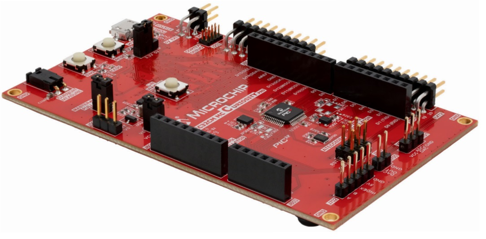

.. _pic32cm_mc00_cpro:

PIC32CM MC00 Curiosity Pro Evaluation Kit
####################################

Overview
********

The PIC32CM MC00 Curiosity Pro is an all-in-one development board for developers to get started with
the PIC32CM series of devices. This board features access to all device GPIO, Arduino Shield compatible headers,
and an on-board programmer/debugger interface for use with MPLABX tools.

Hardware
********

- PIC32CM1216MC00048 MCU
- On-board programmer / debugger interface
- Arduino Shield compatible headers
- Position Decoder (PDEC) interface
- USB or external 3.3V or 5V power
- Multiple buttons and LED's

Supported Features
==================

The pic32cm_mc00_cpro board configuration supports the following hardware
features:

.. list-table::
    :header-rows: 1

    * - Interface
      - Controller
      - Driver / Component
    * - NVIC
      - on-chip
      - nested vector interrupt controller
    * - Flash
      - on-chip
      - Can be used with LittleFS to store files
    * - SYSTICK
      - on-chip
      - systick
    * - WDT
      - on-chip
      - Watchdog
    * - ADC
      - on-chip
      - Analog to Digital Converter
    * - GPIO
      - on-chip
      - I/O ports
    * - PWM
      - on-chip
      - Pulse Width Modulation
    * - USART
      - on-chip
      - Serial ports
    * - I2C
      - on-chip
      - I2C ports
    * - SPI
      - on-chip
      - Serial Peripheral Interface ports
    * - CAN
      - on-chip
      - CAN ports

Other hardware features are not currently supported by Zephyr.

The default configuration can be found in the Kconfig
:zephyr_file:`boards/microchip/pic32cm_mc00_cpro/pic32cm_mc00_cpro_defconfig`.

Pin Mapping
===========

The PIC32MC CM00 Xplained Pro evaluation kit has 4 GPIO controllers. These
controllers are responsible for pin muxing, input/output, pull-up, etc.

For more details please refer to `PIC32CM MC00 Family Datasheet`_ and
the `PIC32CM MC00 Curiosity Pro Schematic`_.

Default Zephyr Peripheral Mapping:
----------------------------------
- ADC0             : PB09
- ADC1             : PA08
- CAN0 TX          : PA24
- CAN0 RX          : PA25
- CAN1 TX          : PB14
- CAN1 RX          : PB15
- SERCOM0 USART TX : PB24
- SERCOM0 USART RX : PB25
- SERCOM1 I2C SDA  : PA16
- SERCOM1 I2C SCL  : PA17
- SERCOM2 USART TX : PA12
- SERCOM2 USART RX : PA13
- SERCOM4 USART TX : PB10
- SERCOM4 USART RX : PB11
- SERCOM5 SPI MISO : PB00
- SERCOM5 SPI MOSI : PB02
- SERCOM5 SPI SCK  : PB01
- GPIO/PWM LED0    : PC05

System Clock
============

The PIC32CM MCU is configured to use the 32.768 kHz internal oscillator
with the on-chip internal oscillator generating the 48 MHz system clock.

Serial Port
===========

The PIC32CM MCU has eight SERCOM based USARTs with three configured as USARTs in
this BSP. SERCOM4 is the default Zephyr console.

- SERCOM0 9600 8n1
- SERCOM2 115200 8n1
- SERCOM4 115200 8n1 connected to the onboard Embedded Debugger (EDBG)

PWM
===

The PIC32CM MCU has 3 TCC based PWM units with up to 4 outputs each and a period
of 24 bits or 16 bits.  If :code:`CONFIG_PWM_SAM0_TCC` is enabled then LED0 is
driven by TCC2 instead of by GPIO.

Programming and Debugging
*************************

The PIC32CM MC00 Curiosity Pro comes with a Embedded Debugger (EDBG). This
provides a debug interface to the PIC32CM chip and is supported by
OpenOCD.

Flashing
========

#. Build the Zephyr kernel and the ``hello_world`` sample application:

   .. zephyr-app-commands::
      :zephyr-app: samples/hello_world
      :board: pic32cm_mc00_cpro
      :goals: build
      :compact:

#. Connect the PIC32CM MC00 Curiosity Pro to your host computer using the USB debug
   port.

#. Run your favorite terminal program to listen for output. Under Linux the
   terminal should be :code:`/dev/ttyACM0`. For example:

   .. code-block:: console

      $ minicom -D /dev/ttyACM0 -o

   The -o option tells minicom not to send the modem initialization
   string. Connection should be configured as follows:

   - Speed: 115200
   - Data: 8 bits
   - Parity: None
   - Stop bits: 1

#. To flash an image:

   .. zephyr-app-commands::
      :zephyr-app: samples/hello_world
      :board: pic32cm_mc00_cpro
      :goals: flash
      :compact:

   You should see "Hello World! pic32cm_mc00_cpro" in your terminal.

References
**********

.. target-notes::

.. _Microchip website:
    https://www.microchip.com/en-us/development-tool/ev15n46a

.. _PIC32CM MC00 Family Datasheet:
    https://ww1.microchip.com/downloads/aemDocuments/documents/MCU32/ProductDocuments/DataSheets/PIC32CM-MC00-Family-Data-Sheet-DS60001638.pdf

.. _PIC32CM MC00 Curiosity Pro Schematic:
    https://ww1.microchip.com/downloads/en/DeviceDoc/PIC32CM-MC00-Curiosity-Pro-Developmen-Board-Design-Documentation.zip
